# SymDoc - Dokumentation der IP-Symcon Umgebung
SymDoc erzeugt eine Dokumentation auf Basis von MD-Dateien (https://de.wikipedia.org/wiki/Markdown). Das ist die Syntax die auch für diese README Datei verwendet wird.
Es erzeugt eine Übersichtsseite mit einer tabellarischen und gruppierten Darstellung aller (per Konfiguration) gewünschter
Objekte. Um die Doku zu lesen gibt es u.a. Browser Plugins (Firefox Plugin: Markdown Viewer Webext).   
Zu jedem Objekt (außer Link-Objekten) gibt es einen Hyperlink der auf eine Detailseite des jeweiligen Objektes verweist.
In dieser tabellarischen Darstellung wird bspw. auch die Objekt-Info als Beschreibung ausgegeben.
Der Objekt-Info kommt zusätzlich zum reinen beschreibenden Character noch eine wesentliche Funktion zu - Tags (Details siehe weiter unten).

> Dieses Modul wurde nach bestem Wissen und Gewissen erstellt. Der Einsatz erfolgt auf eigene Gefahr und der Autor ist nicht haftbar für eventuelle Schäden.

### Inhaltverzeichnis

1. [Funktionsumfang](#1-funktionsumfang)
2. [Voraussetzungen](#2-voraussetzungen)
3. [Installation](#3-installation)
4. [Hashtags](#4-hashtags)
5. [Doku-betrachten](#5-doku-betrachten)
6. [Screenshots](#6-screenshots)
7. [PHP Kommandos](#7-php-kommandos)
8. [Todo](#8-todo)
9. [Aufmerksamkeit](#9-aufmerksamkeit)


### 1. Funktionsumfang
* Folgende Objekt-Typen werden von der Dokumentation berücksichtigt
    * Scripts
    * Variablen
    * Ereignisse
    * Medien
    * Instanzen
    * Links

* Pro Objekt wird eine Detailseite (./details/ObjectId.md) erzeugt die von der Übersichtsseite aus verlinkt wird.
* Die Übersichtsseite enthält tabellarisch folgende Informationen
    * Header
    * Allgemeine Benutzerspezifische Angaben (Inhalt aus einer IPS Variable)
    * Allgemeine IPS Informationen
    * Erweitere IPS Einstellungen
    * Logische Gruppen pro #Tag mit Auflistung der einzelnen zugehörigen Objekttypen
    * Footer
* Defekte Scripte (broken) werden auf der Übersichtsseite durchgestrichen
* Es kann mit #Hashtags in den Objektbeschreibungen gearbeitet werden. Damit werden Objekte nach Tags gruppiert angezeigt (bspw. werden Scripte, Variablen, Instanzen, etc. #Wohnzimmer #Beleuchtung) entsprechend gruppiert angezeigt.
* Über eine TextBox Variable können entweder statische oder dynamische Inhalte in den Kopf der Doku geschrieben werden. Bspw.: Erklärender Text für jemanden der die Doku sieht und vielleicht nicht mit den Details der Haustechnik vertraut ist. Alternativ kann die Variable auch durch Skriptbefüllung aktuelle Informationen die im Kopf der Doku stehen sollen anzeigen.
* Es werden einige PHP Funktionen zur Einbindung in eigene Skripte angeboten (u.a. eine Logik um rekursiv die ObjectInfo zu beschreiben): Siehe [PHP-Befehlsreferenz](#7-php-befehlsreferenz)


### 2. Voraussetzungen
* IP-Symcon Version 5

### 3. Installation

> Bei kommerzieller Nutzung (z.B. als Errichter oder Integrator) wenden Sie sich bitte an den Autor.

* Die Instanz "SymDoc" anlegen
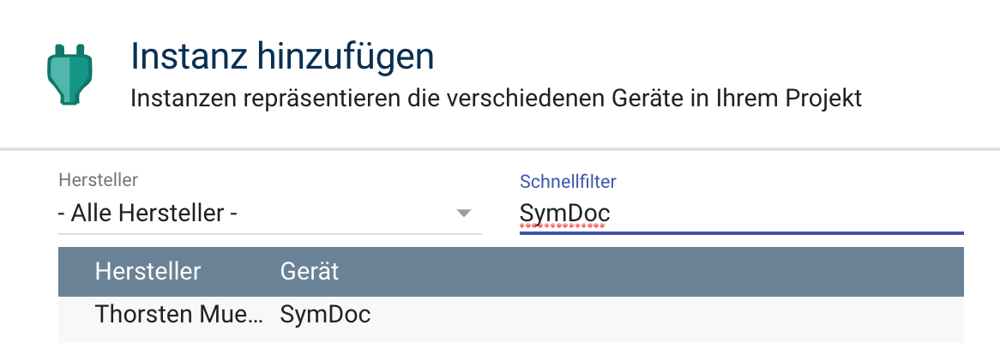
* Das Ausgabeverzeichnis der Doku angeben (der Ordner muss bereits existieren).
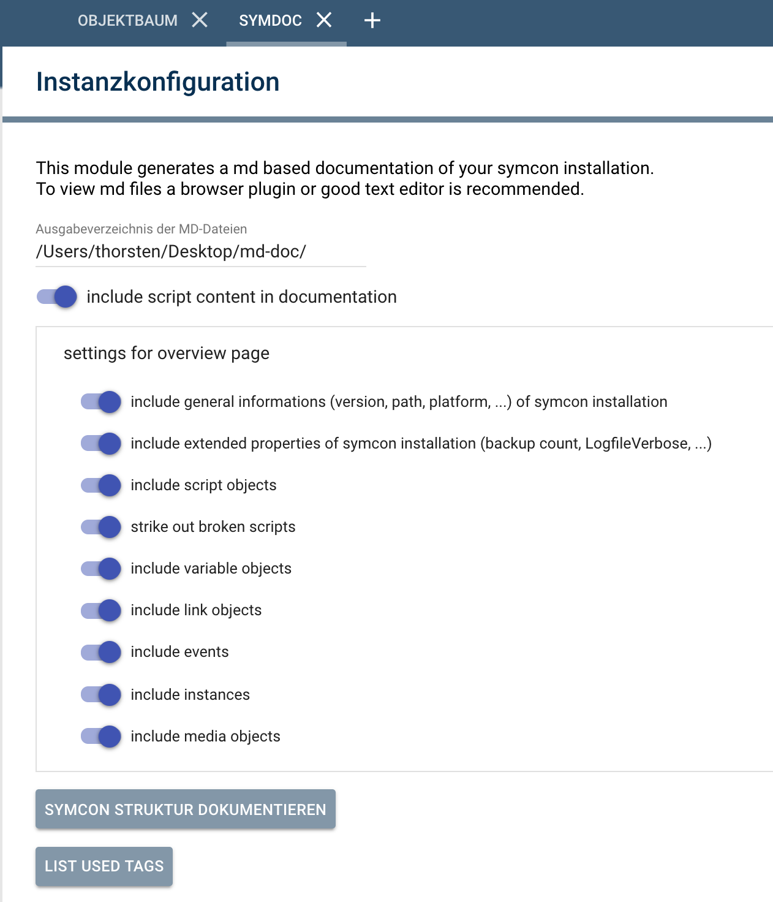

### 4. Hashtags
In der Beschreibung (ObjectInfo) von Objekten (egal welchen Typs) kann neben dem Beschreibungstext noch mit Hashtags (bspw. #Wohnzimmer, #Beleuchtung) gearbeitet werden.

Beispiel einer Objekt-Info: "Dieses Skript schaltet das #Licht im #Wohnzimmer bei #Sonnenuntergang ein wenn der #TV läuft".
Dieses Objekt würde jetzt auf der Übersichtsseite der Dokumentation unter den Gruppen "Licht", "Wohnzimmer", "Sonnenuntergang" und "TV" auftauchen.
Wenn man also diverse Objekte (Variablen, Skripte, Medien, etc.) mit gleichen Tags verwendet entsteht daraus in der Übersichtsseite eine logische Gruppierung. Somit kann man bspw. schnell einen Überblick der Objekte für die Beleuchtung zu bekommen.

### 4. Doku erstellen
> ACHTUNG: Je nach Größe der IP-Symcon Umgebung und der verwendeten Hardware kann die Erzeugung der Dokumentation einige Momente dauern.
* Auf der Modul Konfigurationsseite durch Klick auf "Symcon Struktur dokumentieren".
* Per PHP Codeaufruf: SymDoc_WriteMd(Id);    

Im konfigurierten Ausgabeverzeichnis wird ein Unterverzeichnis (aktuelles Datum) angelegt. Darunter wird die Dokumentation erzeugt.

Auf der Übersichtsseite werden die abfragbaren Informationen tabellarisch aufgelistet. Zusätzlich wird das Feld "ObjectInfo" angezeigt, somit empfiehlt es sich (gerade bei wichtigen Objekten) einen zusätzlichen Beschreibungstext einzugeben.

### 5. Doku betrachten
Es gibt mehrere Möglichkeiten MD-Dateien zu betrachten.
* Browser Plugin (bspw. Firefox Plugin: Markdown Viewer Webext)
* Texteditor/Plugin (Atom, Notepad++, Visual Studio Code)
* Eigenständige MD-Betrachter

## 6. Screenshots
Da Bilder bekanntlich mehr sagen als Worte sind hier einige Screenshots.

### 6.1 Screenshots aus der IPS Webconsole
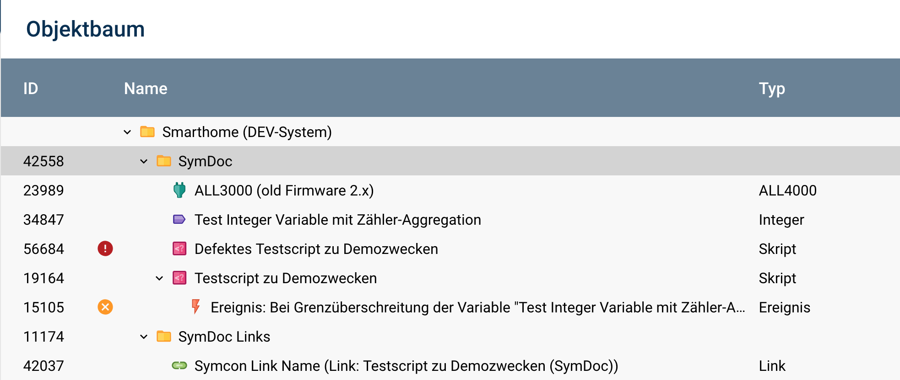
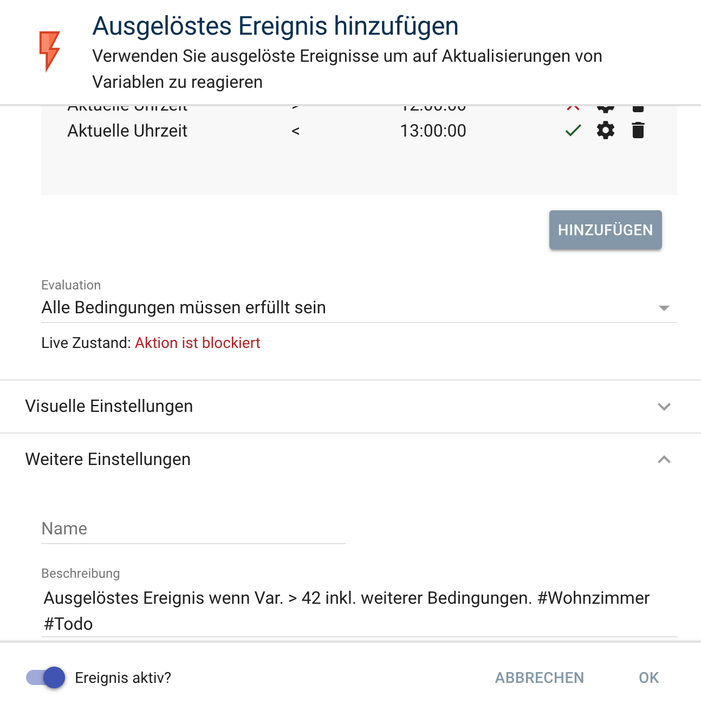
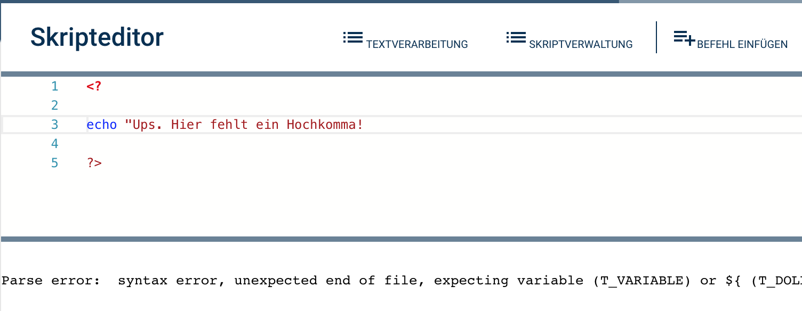
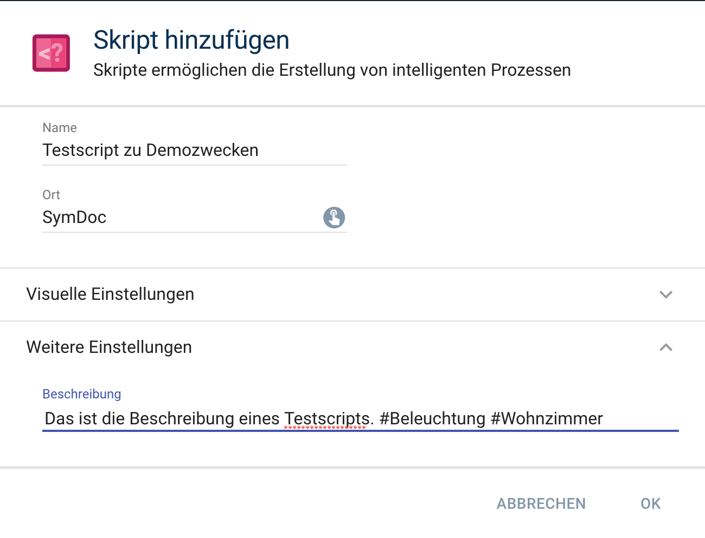
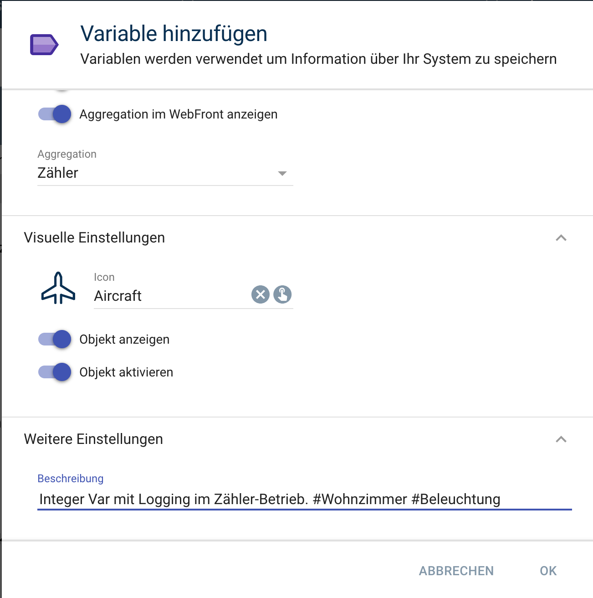

### 6.2 Screenshots aus der generierten Dokumentation
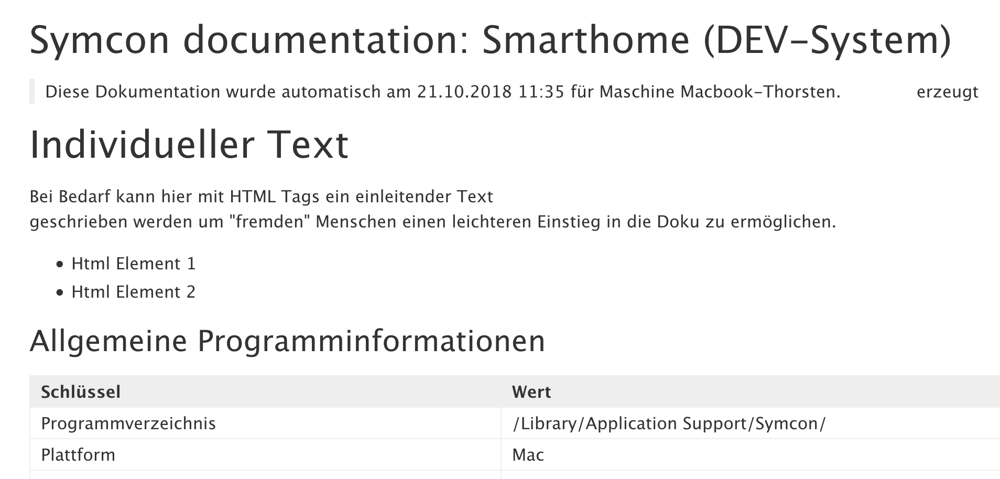
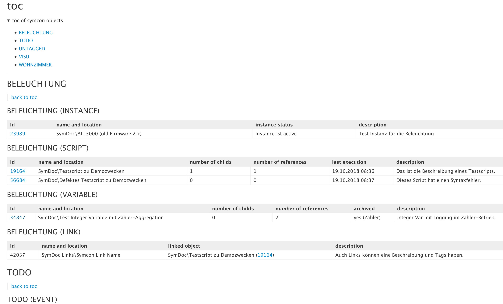
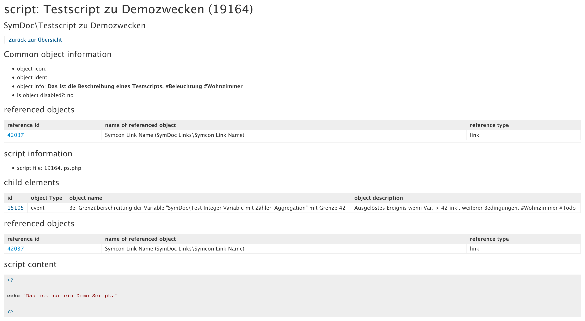
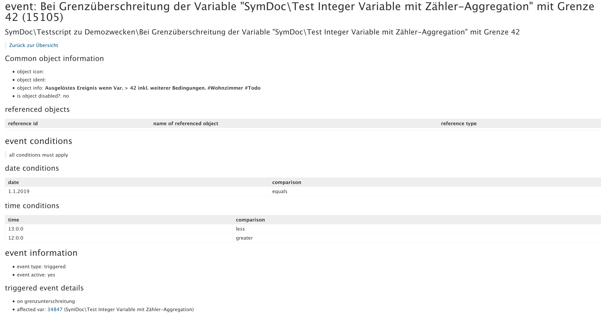
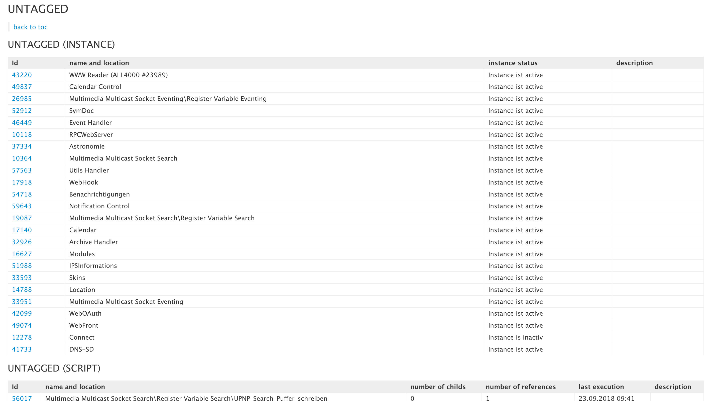


### 7. PHP Kommandos

```php
<?

$symDocInstance = <Id>;

// Erzeugt die Dokumentation
SymDoc_WriteMd($symDocInstance);

// Liefert ein Array mit allen verwendeten Tags gemäß ObjectInfo
$allTags = SymDoc_ListTags($symDocInstance);
print_r($allTags);

// Schreibt für alle Objekte unterhalb von ParentId rekursiv eine ObjectInfo und hängt diese an eine bestehende ObjectInfo an.
SymDoc_WriteRecursiveObjInfo($symDocInstance,<ParentId>,"Das ist die Beschreibung. #Tag1 #Tag2", true);

?>
```

### 8. Todo
Es gibt noch einige offene Themen
* | (Pipe) Zeichen im Objektnamen maskieren, damit Tabelle optisch nicht verzerrt wird
* Dubletten aus Referenztabellen rausfiltern
* Ereignisdetailseite verbessern
    * (zykl. Ereignisse): Komplexe Einstellungsmöglichkeiten
    * (Wochenplan): Komplexe Zeitpläne
* Tabellen sortieren (nach konfigurierbarer Spalte)
* PDF Export
* Export Verzeichnis auf eine Netzwerkfreigabe
* Ladekringel beim Starten der Doku aus Konfigurationsformular, damit ersichtlich ist, dass die Doku Erzeugung noch läuft
* Eventuelle PHP Timeouts berücksichtigen
* Konfigurationsformular (SelectDir statt SelectFile - gibts die Möglichkeit?)
* Problem falls ModulId bei Instanzen nicht funktioniert (aktuell auskommentiert)


### 9. Aufmerksamkeit
Die Erstellung dieses Moduls hat mich viel Zeit, Arbeit, Schweiß und vor allem Nerven gekostet!
Für die nicht kommzerielle Nutzung ist es kostenlos. Feedback (Lob, Kritik, Anregungen, etc.) ist gerne im IPS Forum gesehen

thorsten9
